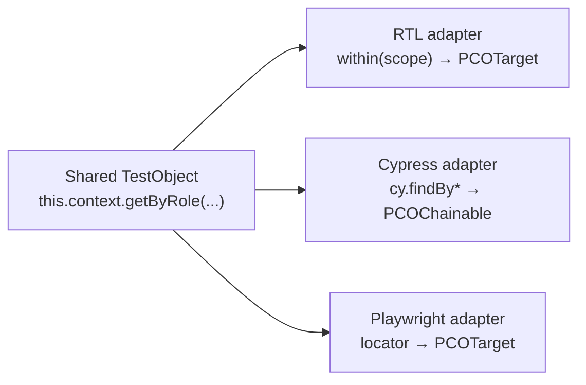

# Portability

PCO’s headline is **same model, runner-native execution**. Test objects describe *what* to find and *how* to act; adapters decide *how* that resolves in Vitest, Storybook, or Cypress.

## What is portable

These travel in shared `*.to.ts` / `*.to.tsx` files under `__pco__`:

| Portable | Notes |
|----------|-------|
| **Object hierarchy** | Class structure, getter names, intent method signatures |
| **Query definitions** | `this.context.getByRole(...)`, `findByLabelText(...)`, etc. |
| **`rootResolver` composition** | Child TOs scoped via parent resolver |
| **Intent methods** | `fillCheckout()`, `openSettings()` — compose primitives |
| **MSW handler definitions** | `setupMockData()` body — shared between Vitest/Jest and Storybook |
| **Data factories** | `DataFactory` / `*.factory.ts` — plain domain payloads |

## What is not portable

Keep these in runner-specific specs or adapter setup — do not pretend they unify:

| Runner-native | Why |
|---------------|-----|
| **Assertion APIs** | `expect()` (Vitest/Jest) vs `cy.should()` (Cypress) vs Playwright `expect(locator)` |
| **Render / navigation lifecycle** | `await view.render()` vs `cy.visit()` vs `page.goto()` |
| **MSW transport** | Node `setupServer` and Storybook addon — not available in Cypress E2E |
| **Raw element types in shared code** | Shared TOs type against `PCOContext` / `PCOTargetBase`, not `HTMLElement` or `Chainable` |
| **Cypress-only chain methods** | `.should()`, native `.click()` — present at runtime in Cypress specs via `PCOChainable`, absent from shared typings |

## Query context by runner

| Runner | Scope source | Query execution |
|--------|--------------|-----------------|
| Vitest / Jest | `screen` or `within(canvas)` | Sync `getBy*` / async `findBy*` → `PCOTarget` |
| Storybook | Story canvas element | Same RTL adapter after `bindResolver` |
| Cypress | `() => cy.get(...)` chain | `@testing-library/cypress` enqueued on chain |
| Playwright (spike) | `page` / `locator` | Native `Locator` + `await` |

## getBy / queryBy / findBy — user choice

The framework does **not** pick one query style for you. Expose the full Testing Library surface on `this.context`; adapters map semantics:

| API | Vitest / Jest | Cypress |
|-----|---------------|---------|
| `queryBy*` | Sync; returns null target | Snapshot or chain variant |
| `getBy*` | Sync; throws if missing | Maps to retrying find on chain |
| `findBy*` | Async + `waitFor` | `cy.findBy*` with implicit retry |

Document runner quirks in specs when timing matters. See [resolver-model.md](./resolver-model.md#getby--queryby--findby-policy).

## Cypress boundaries

Cypress E2E reuses **getter definitions** from DOM-only test objects. It does **not** reuse:

- `BaseViewTestObject.render()` or MSW `setupMockData()`
- Node `UserAgent` `await` patterns inside bare `.then()` without chaining

Prefer `CypressComponentTestObject` getters that enqueue `cy.findBy*`. See [cypress-adoption.md](./cypress-adoption.md).

## MSW bridge (node + Storybook)

Handler **definitions** in `setupMockData()` are portable. The **runtime** differs:

- Vitest/Jest: `@page-component-object/msw` session + `installPCOLifecycle`
- Storybook: `storyParameters()` / `mockSession()` via `@page-component-object/adapter-storybook`

Cypress hits a real HTTP server (or stubbed at network layer outside PCO).

## Type partitions prevent leakage

Shared `*.to.ts` files import types against `PCOContext` and `PCOTargetBase` only. Cypress chain methods (`.should()`) are merged at runtime by the adapter — not referenced in shared code. This keeps TypeScript honest without a `native()` escape hatch.

## Evolution: `QueryContext` → resolver model

`packages/core` `QueryContext` was a minimal RTL shape for early adapters. The `0.2.x` resolver model replaces eager `HTMLElement` storage with `rootResolver` + `PCOContext`. Legacy `bindToRoot(el)` maps to `bindResolver(() => el)`.

## Related

- [Resolver model](./resolver-model.md)
- [Cypress adoption](./cypress-adoption.md)
- [Cross-runner tutorial](./cross-runner-tutorial.md)
- [MSW in Storybook](./msw-storybook.md)
