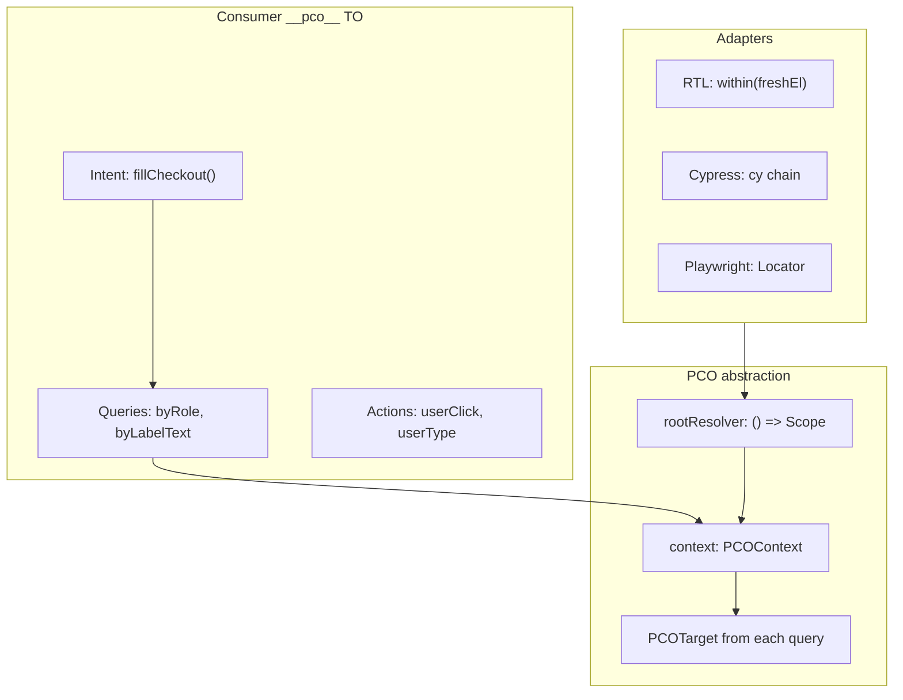

# Resolver model

The resolver model fixes the real cross-runner problem: **eager `HTMLElement` storage** in `this._root` / `this._context`. That pattern causes Cypress detached DOM, RTL partial-assignment staleness, and duplicate test object classes for E2E.

## Problem: stored elements vs lazy scope

| Symptom | Vitest / Jest | Cypress |
|---------|---------------|---------|
| Getter runs child query | Works at access time | Builds command queue before DOM touch |
| `const cell = view.cells[3]` then later `cell.click()` | **Stale** after re-render | **Detached** if `_root` captured in `.then()` |
| `new PCO(element)` constructor | Freezes container | `cy.wrap(staleElement)` breaks retry chain |

```ts
// BAD — partial assignment captures HTMLElement (today)
const btn = view.submitBtn;
await btn.click(); // may target detached node after re-render

// GOOD — PCOTarget re-resolves on each interaction
await view.submitBtn.userClick();
```

## Three layers



| Member | Role |
|--------|------|
| `rootResolver` | Sync `() => Scope` — **never stores DOM** |
| `context` | Full TL query API fixed to `rootResolver` → `PCOTarget` |
| `root` | Optional materialization of `rootResolver` (RTL convenience; Cypress debug only) |

**Sync resolvers only:** `ContextResolver = () => Scope`. No `async` resolvers in v1 — Cypress deferral lives inside the chain returned by the resolver.

## Partitioned types

```ts
/** Base partition — shared TO code + RTL adapter */
interface PCOTargetBase<TNode = unknown> extends PromiseLike<TNode> {
  userClick(opts?: ClickOptions): PCOTargetBase<TNode>;
  userType(text: string, opts?: TypeOptions): PCOTargetBase<TNode>;
  userClear(): PCOTargetBase<TNode>;
}

/** Query partition — what this.context returns */
interface PCOContext extends PCOTargetBase {
  getByRole(...): PCOTarget;
  queryByRole(...): PCOTarget | null;
  findByRole(...): PCOTarget;
  getByLabelText(...): PCOTarget;
  // ... full TL surface
  within(resolver: ContextResolver): PCOContext;
}

/** Cypress runtime merge — not imported in shared *.to.ts */
type PCOTarget = PCOTargetBase & Cypress.Chainable<JQuery<HTMLElement>>;
```

Shared test objects type against `PCOContext` / `PCOTargetBase`. Cypress specs get chain methods at runtime without `native()`.

## Child test objects

Both patterns are supported:

```ts
// A) Explicit resolver
new RowTO(() => this.context.findByRole('row', { name: /x/i }).rootResolver);

// B) Parent wrapper
this.child(RowTO, (p) => p.context.findByRole('row', { name: /x/i }));
```

## Adapter scope mapping

| Adapter | Document scope | Nested scope |
|---------|----------------|--------------|
| RTL | `() => screen` | `() => within(parentResolve())` |
| Cypress | `() => cy` / document | `() => cy.get(...)` chain from parent |
| Playwright (spike) | `page` | `locator(root)` |

## getBy / queryBy / findBy policy

The framework exposes the full Testing Library surface. **You choose** per getter; adapters map execution:

| API | RTL adapter | Cypress adapter |
|-----|-------------|-----------------|
| `queryBy*` | Sync; null if absent | Sync snapshot or chain variant |
| `getBy*` | Sync throw | Chain with implicit retry |
| `findBy*` | Async `waitFor` | `cy.findBy*` |

Document timing quirks in specs — `getBy` fails fast in JSDOM; Cypress retries via command queue.

## Anti-patterns

```ts
// BAD Cypress: captured element as resolver
cy.get('.sidebar').then(($el) => new PCO(() => cy.wrap($el[0])));

// GOOD Cypress: chain as resolver
new PCO(() => cy.get('[data-testid="sidebar"]'));

// BAD: sync RTL getter used in Cypress after navigation
get heading() {
  return this.context.getByRole('heading', { name: /items/i }); // runs NOW
}
cy.wrap(view.heading).click(); // no retry queue

// GOOD Cypress: enqueues command
get heading() {
  return this.context.findByRole('heading', { name: /items/i });
}
view.heading.should('contain.text', 'Items');
```

## Runtime guards

Adapters throw `PcoUnsupportedInRuntimeError` for APIs that do not translate:

| Pattern | Cypress | RTL |
|---------|---------|-----|
| `this.root.querySelector` | **Throw** — use `this.context` | Warn — prefer TL queries |
| `.should()` on target | N/A | **Throw** — use `expect()` |
| `cy.wrap(capturedEl)` in resolver | **Throw** | N/A |

## Migration from 0.1.x

| 0.1.x | 0.2.x |
|-------|-------|
| `constructor(root?: HTMLElement)` | Internal `rootResolver = () => root` |
| `bindToRoot(el)` | `bindResolver(() => el)` |
| `this._root` stored | Dropped — `rootResolver` is source of truth |
| `CypressComponentTestObject` duplicate class | Unified `ComponentTestObject` + Cypress adapter injection |

Jest/Vitest/Storybook demos must pass unchanged behind the RTL adapter before Cypress switches default paths.

## Benefits

- **Re-render:** `tables[1].cells[3].userClick()` after intentional re-render
- **Storybook:** `bindResolver(() => within(canvasElement))`
- **One TO class:** queries defined once; adapters differ in resolver + action execution
- **Playwright:** `rootResolver: () => page.getByTestId('sidebar')` — see Playwright spike in `packages/adapters/playwright`

## Related

- [Portability](./portability.md)
- [Cypress adoption](./cypress-adoption.md)
- [Cross-runner tutorial](./cross-runner-tutorial.md)
