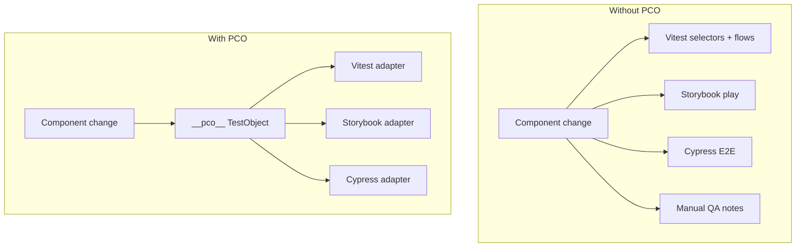
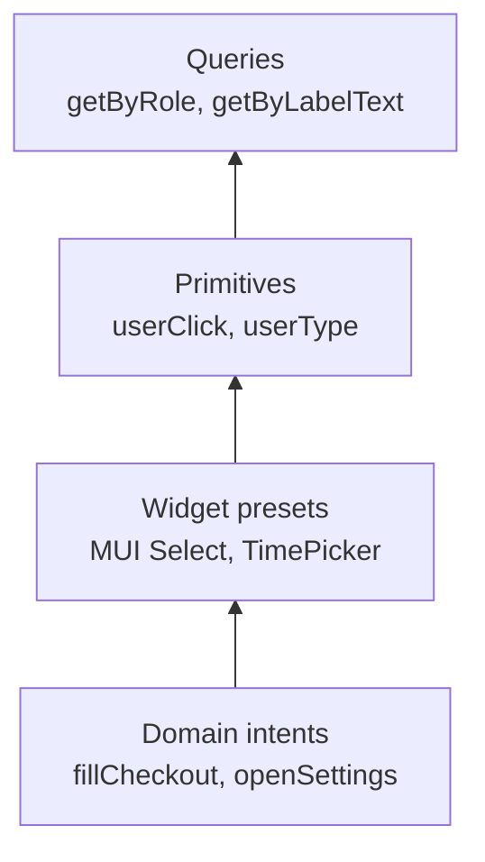
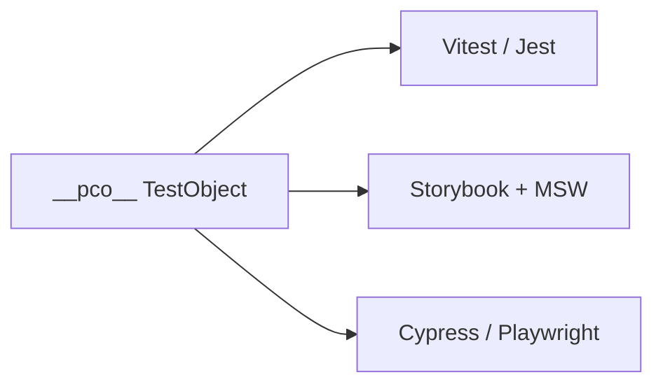

# Why PCO?

This page expands the [README](../README.md#what-it-is) with diagrams and adoption signals. For install and a quick example, stay on the README.

Page Component Object (PCO) is a **toolset for behavioral integration tests** — TestObjects centralize scoped queries and user interactions so specs do not accumulate fragile `queryByRole` chains. The cross-runner adapter layer extends that same contract to Vitest, Storybook, and Cypress.

The core question PCO answers:

> **Where does the application’s test-facing contract live — and who maintains it when the UI changes?**

Without TestObjects, integration specs inline DOM queries and interaction blocks. A new "Accept" button elsewhere on the page breaks an unrelated test. Modal flows reappear as nested `within()` scopes copy-pasted across files. The **knowledge** of how to reach a widget in context never gets a home.

PCO centralizes that knowledge in **`__pco__`** test objects (`*.to.ts` / `*.to.tsx`) beside your features. Runners consume the description through **adapters** when you need the same intents in Storybook `play` or Cypress — not as a prerequisite for scoped, stable behavioral tests in a single runner.

## The duplication problem (cross-runner)

Once TestObjects work in Vitest or Jest, the same widget intents often get **redefined** for Storybook `play` and Cypress — parallel getter sets for identical knowledge:

| Concern | Three parallel copies | One `__pco__` surface + adapters |
|--------|------------------------|----------------------------------|
| Widget intents (date picker, select, dialog) | Copied per runner | One intent method; runner executes it |
| DOM queries (`getByRole`, labels) | Three getter sets | One getter definition |
| API boundary (MSW handlers) | Duplicated setup | `setupMockData()` shared with Storybook |
| Maintenance | Fix the same flow in three places | Fix once in preset or view TO |

## Knowledge centralization

PCO organizes test knowledge in layers — smallest reusable unit at the bottom, domain flows at the top:

| Layer | Owner | Example |
|-------|-------|---------|
| **Query** | Framework (`ComponentTestObject`) | `get email()` → role/label query |
| **Primitive** | Framework | `await field.userType('alice@example.com')` |
| **Widget intent** | `@page-component-object/preset-*` or your TO | `await datePicker.selectDate('2026-01-15')` |
| **Domain intent** | Your `*.to.*` | `await view.fillCheckout()` |

When a MUI `Select` changes from native `<select>` to a listbox portal, you update **one** preset — not every spec that touches a dropdown.

## What PCO is not

PCO is **not** a replacement for Testing Library, Cypress, or Vitest. It is a **structure layer** on top of them:

- **Not** hiding Cypress command chains — native `.should()`, `.click()`, and retry semantics stay available. See [cypress-adoption.md](./cypress-adoption.md).
- **Not** a DI framework or test harness monopoly — `App.get()` is a convenience singleton with a documented reset contract; see [getting-started.md](./getting-started.md#level-3--app-harness-msw-and-routing).
- **Not** asserting for you — `expect` (node), `cy.should` (Cypress), and [semantic-matchers](https://github.com/dvegap95/semantic-matchers) for API spies remain runner-native.

## HTTP boundary

UI test objects describe **what the user sees and does**. API contracts live in `*Api.to.ts` with MSW handlers in `setupMockData()`; **semantic-matchers** assert what the client sent (`toHaveBeenLastCalledWithUrl`, etc.) without standing up server logic in tests.

That split keeps DOM queries separate from HTTP shape checks and avoids the two common traps: mocking only the response (missing the request) or branching handlers on request (server complexity in the suite). See [http-boundary.md](./http-boundary.md) and [matchers.md](./matchers.md).

## When PCO pays off

PCO earns its folder structure when:

1. **The same view** is tested in Vitest/Jest, Storybook, and/or Cypress.
2. **Widget knowledge** (MUI, Radix, custom design system) repeats across screens.
3. **API + UI** triangulation matters — MSW handlers in node tests and Storybook share one definition.

If you only ever run a single runner on throwaway smoke tests, a thin RTL wrapper may be enough. See [when-not-to-use.md](./when-not-to-use.md).

## Cross-runner triangulation

The strongest combination is **Vitest + Storybook + MSW**: behavioral specs and visual stories exercise the same HTTP contract and the same test object getters. Cypress (and future Playwright) extend that contract to a live browser without duplicating selector knowledge.

Cross-runner **definition** reuse (one class, every runner) is the active `0.2.x` goal — [resolver model](./resolver-model.md). Cypress may still use a parallel DOM-only class for chainable getters until that lands; see [cross-runner-tutorial.md](./cross-runner-tutorial.md).

## Next steps

| Level | Start here |
|-------|------------|
| 1 — Component objects only | [Getting started — Level 1](./getting-started.md#level-1--component-test-objects) |
| 2 — Same getters, multiple runners | [Cross-runner tutorial](./cross-runner-tutorial.md) |
| 3 — App harness + MSW | [Getting started — Level 3](./getting-started.md#level-3--app-harness-msw-and-routing) |

- [Design principles](./design-principles.md) — runtime contracts and escape hatches
- [Philosophy](./philosophy.md) — query → primitive → intent layers
- [Portability](./portability.md) — what travels vs what stays runner-native
